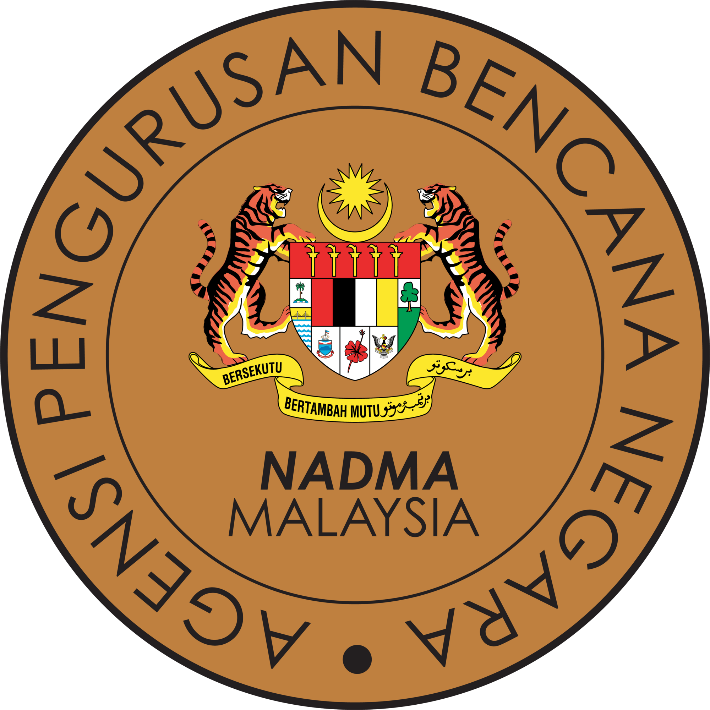

# Nadma

<p align="center">
  
</p>


**Nadma** is an Android mobile application developed using Kotlin. It is designed to provide users with real-time information, resources, and updates on disaster management in Malaysia, specifically aligned with the official objectives of the National Disaster Management Agency (NADMA). The app facilitates access to vital disaster-related news, emergency alerts, and detailed protocols for disaster management.

## Table of Contents

- [Features](#features)
- [Installation](#installation)
- [Usage](#usage)
- [About NADMA](#about-nadma)
- [Contributing](#contributing)
- [License](#license)
- [Author](#author)

## Features

- **Real-Time Alerts**: Provides timely notifications on weather changes, emergency alerts, and disaster updates across Malaysia.
- **Splash Screen**: Presents the NADMA logo upon app launch.
- **Welcome Activity**: Offers a guided introduction to the app for first-time users.
- **Main Activity**: Displays key disaster management information and resources for users.
- **User-Friendly Interface**: Simple navigation, making information easily accessible.
- **Information Hub**: Displays updates on flood warnings, thunderstorm alerts, tropical cyclones, and other disaster-related news.

## Installation

1. **Clone the repository**:
    ```sh
    git clone https://github.com/IRedDragonICY/cb24153-nadma.git
    cd cb24153-nadma
    ```

2. **Open the project in IntelliJ IDEA**:
    - Open IntelliJ IDEA.
    - Select `Open` and navigate to the cloned repository.

3. **Build the project**:
    - Ensure you have the latest version of Android Studio and the Android SDK installed.
    - Sync the project with Gradle files.

## Usage

1. **Run the application**:
    - Connect an Android device or start an emulator.
    - Click on the `Run` button in IntelliJ IDEA.

2. **For first-time users**:
    - The app will launch the `WelcomeActivity`, guiding users through key app features.
    - For subsequent logins, users will be directed straight to the `MainActivity`.

3. **Receive updates**:
    - The app will provide disaster-related information, weather updates, and emergency guidelines in real-time.

## About NADMA

The **National Disaster Management Agency (NADMA)** operates under the Prime Minister's Department of Malaysia. It plays a central role in coordinating disaster management efforts, ensuring preparedness, response, and recovery across all levels of government and the public. Key initiatives include:

- **Disaster Information Management**: Real-time updates on natural disasters like floods, thunderstorms, earthquakes, and air pollution levels.
- **SMART Team Deployment**: Rapid response teams for emergency situations.
- **Public Awareness Campaigns**: Educating the public about disaster risks, response strategies, and safety protocols.

For more information, visit the official NADMA website at [NADMA.gov.my](https://www.nadma.gov.my).

## Contributing

Contributions are welcome! Please follow these steps:

1. Fork the repository.
2. Create a branch for your feature or bug fix.
3. Submit a pull request detailing your changes.

## License

This project is licensed under the GNU General Public License v3.0. See the [LICENSE](LICENSE) file for more information.

## Author
<p align="center">   </p>

- **Hendianto Mohammad Farid**  
  - **Matrix Number**: CB24153  
  - **Affiliation**: Ahmad Dahlan University (mobility) to Universiti Malaysia Pahang Al-Sultan Abdullah  
  - **Course**: Mobile Application Development (MAD)  
  - **Instructor**: PUAN NABILAH BINTI ALIAS
